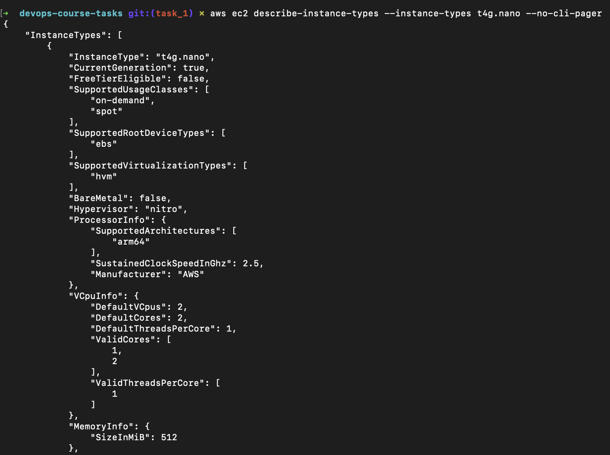

# "AWS DevOps Course" · RS School 2025Q2

This repository contains the infrastructure code and CI/CD workflows for the **AWS DevOps Course** by **RS School** (2025Q2).

## Structure

```bash
.
├── README.md
├── .github/
│   └── workflows/      # GitHub Actions workflows
│       └── README.md   # Overview of CI/CD workflows
└── terraform/          # Terraform Infrastructure
    ├── README.md       # Overview of Terraform structure
```

## Description

* The [`terraform/`](terraform/README.md) directory contains Terraform code to provision cloud infrastructure.
* The [`.github/workflows/`](.github/workflows/README.md) directory includes GitHub Actions workflows for automated CI/CD operations.

Each section has its own `README.md` with detailed instructions and documentation.

## Prerequisites

### AWS Account Setup and Security

- **You need an AWS Account**.

  > [!WARNING]
  >  It's important to be mindful of costs, especially with the free tier, and destroy resources when not in use to avoid unexpected charges.

- **Create an IAM User in your AWS Account**
  This user should be used for day-to-day operations instead of the root account, which has all permissions.

  <details>
    <summary>Example</summary>
    
    1. Sign in to the AWS Management Console and open the IAM console at <https://console.aws.amazon.com/iam/>
    
    2. Create IAM User group called `rs.school` with the following policies:

       - [x] AmazonEC2FullAccess,
       - [x] AmazonEventBridgeFullAccess
       - [x] AmazonRoute53FullAccess,
       - [x] AmazonS3FullAccess,
       - [x] AmazonSQSFullAccess,
       - [x] AmazonVPCFullAccess,
       - [x] IAMFullAccess,

       

    3. Create an IAM user called `rs.s-user` and add it to the `rs.school` user group

       

  </details>

- **Configure Multi-Factor Authentication (MFA)** for both the new IAM user and your root user to significantly enhance security

  <details>
    <summary>Example</summary>

    

  </details>

- **Generate a new pair of Access Key ID and Secret Access Key** for the IAM user to enable programmatic access.

  > [!WARNING]
  > It is crucial not to expose these credentials, especially in public repositories like GitHub.

- **Install AWS CLI 2** by following the [instructions](https://docs.aws.amazon.com/cli/latest/userguide/getting-started-install.html).

- **Configure AWS CLI** on your local computer to use the credentials of this new IAM user by following the [instruction](https://docs.aws.amazon.com/cli/latest/userguide/cli-chap-configure.html).

  <details>
    <summary>Example</summary>

    

  </details>
